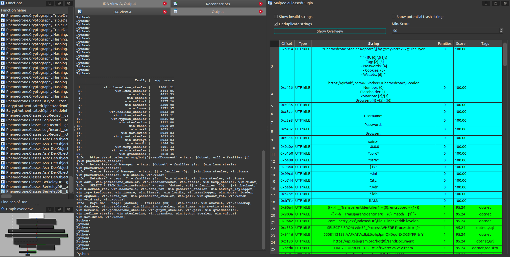

# Malpedia FLOSSed

This repository contains the result of the [FLARE FLOSS tool](https://github.com/mandiant/flare-floss) applied to all unpacked and dumped samples in [Malpedia](https://malpedia.caad.fkie.fraunhofer.de/), pre-processed for further use.

We intend to update this collection periodically.

In the last run in January 2024, 8.522 files associated with 1.845 malware families were processed.  
FLOSSing resulted in 44.666.177 raw strings, which were cleaned and deduplicated down to 3.835.990 unique strings.  
Once decompressed, the collection currently sits at about 900 MB.

## Data Format

The string collection is provided as a JSON dictionary (see folder `data`) and has three sections:

* `about`: like a file header, this contains some metadata about this collection.
* `family_to_id`: a mapping of family_ids to the family names, as found in [Malpedia](https://malpedia.caad.fkie.fraunhofer.de/) (plus some libraries).
* `strings`: the actual data, a dictionary with string as key and value being a dictionary with some additional information.

In short, the data looks like this:
```
{
 "about": {
  "author": "Daniel Plohmann // daniel.plohmann<at>fkie.fraunhofer.de",
  "date_flossed": "2024-01-19",
  "date_published": "2024-01-30",
  "floss_version": "floss v3.0.1-0-g3782dc9",
  "info": "This collection contains the output of applying the FLARE team's floss tool to all unpacked+dumped samples in Malpedia, with additional information in which families the respective string was found, along with its extraction method and encoding. Processing has been applied to reduce the number of mistakenly extracted data strings with no real value to further analysis, FLOSS QUANTUMSTRAND and own tagging has been applied to enrich the output.",
  "license": "Creative Commons BY-SA 4.0",
  "num_malware_families": 1845,
  "num_processed_strings": 3835990,
  "num_samples_flossed": 8522,
  "num_tagged_strings": 1599459,
  "num_total_strings": 44666177,
  "reference": "malpedia.caad.fkie.fraunhofer.de/",
  "source": "https://github.com/malpedia/malpedia-flossed"
 },
 "family_to_id": {
  "elf.anchor_dns": 1121,
  "elf.angryrebel": 1393,
  "elf.babuk": 899,
  ...
  "win.zupdax": 1328,
  "win.zxxz": 1732,
  "win.zyklon": 689
 },
 "strings": {
  ...
  "Mozilla/4.0 (compatible; MSIE 6.0; Win32)": {
   "encodings": [
    "ASCII"
   ],
   "families": [
    79,
    272,
    683,
    914,
    918,
    1000,
    1572
   ],
   "family_count": 7,
   "methods": [
    "static"
   ],
   "string": "Mozilla/4.0 (compatible; MSIE 6.0; Win32)",
   "tags": [
    "user-agent"
   ]
  },
  ...
```

Possible encodings are `ASCII` and `UTF-16LE`, while methods refers to the FLOSS extraction methods `decoded`, `stack`, `static`, `tight`, and `language`.  
The tags are derived from a set of own heuristics as well as based on methods and data found in the [QUANTUMSTRAND](https://github.com/mandiant/flare-floss/tree/quantumstrand/floss/qs) development branch of FLOSS.

## Web Service / Docker

Instead of parsing the huge JSON file every time, we provide a dockerized web service that enables lookups.  
It uses `falcon` as API backend, WSGI'd through `waitress`, proxied for deployments through `nginx`.  
The layout is based on [awesome-compose](https://github.com/docker/awesome-compose/tree/master) but updated and adapted for usage with falcon and waitress.

The service supports single lookups as GET requests and multi-lookups as POST requests:
```
$ curl https://strings.malpedia.io/api/query/FIXME  
{"status": "successful", "data": [{"encodings": ["ASCII"], "families": ["win.kins", "win.vmzeus", "win.zeus_sphinx", "win.citadel", "win.ice_ix", "win.murofet", "win.zeus"], "family_count": 7, "methods": ["static"], "string": "FIXME", "tags": [], "matched": true}, {"matched": false, "string": "NOT_FLOSSED"}]}

$ curl -X POST https://strings.malpedia.io/api/query/ --data '"FIXME","NOT_IN_THE_DATABASE"'
{"status": "successful", "data": [{"encodings": ["ASCII"], "families": ["win.kins", "win.vmzeus", "win.zeus_sphinx", "win.citadel", "win.ice_ix", "win.murofet", "win.zeus"], "family_count": 7, "methods": ["static"], "string": "FIXME", "tags": [], "matched": true}, {"matched": false, "string": "NOT_IN_THE_DATABASE"}]}
```
Check out the [demo Python script](https://github.com/malpedia/malpedia-flossed/blob/main/demo_webservice.py) for how to interact with the service.

We also host a public instance of this service at [strings.malpedia.io](https://strings.malpedia.io).

Here is some [documentation](docs/webservice.md) for the webservice.

## Plugin(s)

A good use case for this collection of strings is probably in binary analysis tools, so we build an IDA Pro plugin that demonstrates this:



Here is some [documentation](docs/plugin.md) for the plugin(s).

We plan to extend tool coverage to at least Binary Ninja and Ghidra in the future.

## Version

* 2024-02-13 v1.3 - Web service now renders HTML results.
* 2024-02-06 v1.2 - Proper decoding of `/api/query/<needle>` when facing urlencoded path, added capability for `contains` queries
* 2024-01-31 v1.1 - Second Release of FLOSSed file, IDA Plugin, web service
* 2024-01-11 v1.0 - Initial Release of FLOSSed file

## License

The data is released as under the [CC BY-SA 4.0 license](https://creativecommons.org/licenses/by-sa/4.0/), allowing commercial usage.