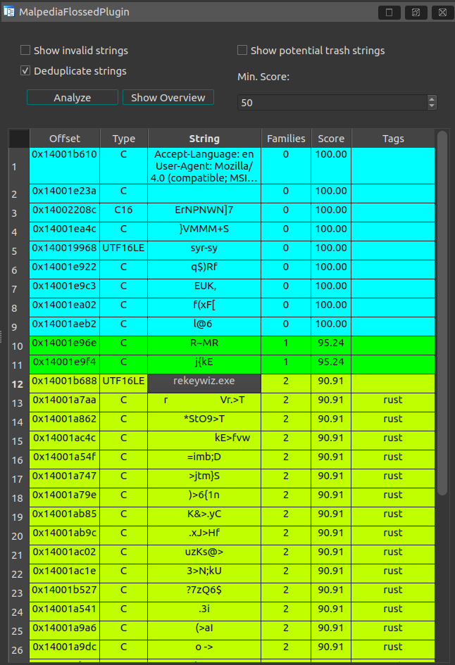

# MalpediaFLOSSed Plugin

A good use of the provided data set is in automation and initial file triage.  
Therefore, we built a plugin for IDA Pro, Ghidra, and Binary Ninja as demonstration.

## Installation

Each binary analysis tool requires its own method of installation, which will be outlined below.

### IDA Pro

In order to use the plugin, you can simply start `FlossedIda.py` as a Python script.  
Alternatively, you can also install it, in which case you need to copy the `config.py`, `FlossedIda.py`, and `plugin` folder to your `<IDA_DIR>/plugins` folder.

### Ghidra

To work with Ghidra, the plugin requires installation of [Ghidraton 4.0+](https://github.com/mandiant/Ghidrathon/releases/tag/v4.0.0).
Afterwards, we can run MalpediaFLOSSed by manually adding our plugin directory to Python's path and then run the plugin:

```
>>> import sys
>>> sys.path.append('/path/to/plugin/malpediaflossed')
>>> import FlossedGhidra
>>> FlossedGhidra.run()
```

Or much easier, we can also use the Script Manager, if we drop `config.py`, `FlossedGhidra.py` and the `plugin` folder into the `Extensions/Ghidraton/ghidra_scripts/` folder (e.g. on Linux found in `~/.ghidra`).

### Binary Ninja

Simply install as a regular plugin by dropping the full `./plugin/malpediaflossed/` folder into Binary Ninja [plugins dir](https://github.com/Vector35/binaryninja-api/tree/dev/python/examples#loading-plugins), afterwards run as View/Other Docks/...


## Configuration

To configure the plugin, adjust the file

```
./plugin/malpediaflossed/config.py
```

The plugin relies on availability of the MalpediaFLOSSed data.  
For this, at least one of the zip files found in [data](https://github.com/malpedia/malpedia-flossed/tree/main/data) should be unpacked, so that a file 

```
./data/malpedia_flossed.json
```

exists.

The plugin is designed to work fully offline by using this file as data foundation, for this you can specify the path `FLOSSED_FILEPATH`.

However, parsing through several hundred megabytes of JSON takes a significant ramp-up time, which is why we also provide a web service for instant lookups.  
If you want to configure the plugin to use the web service instead of the JSON file, simply set a location of the service using `FLOSSED_SERVICE`.
This setting takes precedence over `FLOSSED_FILEPATH` and points by default to our service located at `https://strings.malpedia.io/api/query`.

If you want to have the plugin scan immediately upon start-up, you can also set the flag `AUTO_ANALYZE` to `True`.  
Note that this may not be possible in Binary Ninja due to delayed availability of views and string extraction.


## Usage


The functionality of the menu buttons is as follows:
* `Analyze`: If not having `AUTO_ANALYZE` enabled, this will trigger an analysis and lookup all defined strings against MalpediaFLOSSed.
* `Show Overview`: aggregate all string scores by families and print a ranking in the console - this can possibly serve as an approximation for identification or give hints for relationships.
* `Show invalid strings`: strings that cannot be looked up (and thus are not in the MalpediaFLOSSed collection anyway) will be omitted from the table.
* `Deduplicate strings`: in case a string exists multiple times in the binary, only show the first occurrence in the table.
* `Show potential trash strings`: string extractors are prone to excavating meaningless, wrongly interpreted strings (sequences of instructions in ASCII range etc.) - try to filter them using the built-in heuristics.
* `Min Score`: A score that ranges from 0-100, encoding how "rare" the string is with respect to its occurrence across families in Malpedia.

Furthermore,
* if you double click an address in the table, the view will jump to the location.
* if you click elsewhere in a row, further information on the respective string is printed to the console.

For reference, the plugin looks like this:


