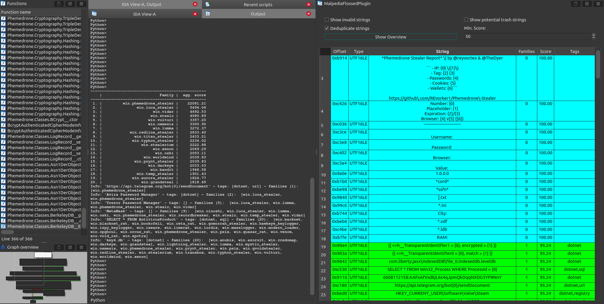

# Plugin

A good use of the provided data set is in automation and initial file triage.  
Therefore, we built an IDA plugin as demonstration.

## General operation

The plugin relies on availability of the MalpediaFLOSSed data.  
For this, at least one of the zip files found in [data](https://github.com/malpedia/malpedia-flossed/tree/main/data) should be unpacked, so that a file 

```
./data/malpedia_flossed.json
```

exists.

The plugin is designed to work fully offline by using this file as data foundation.
However, parsing through several hundred megabytes of JSON takes a significant ramp-up time, which is why we also provide a web service for instant lookups.  
If you want to configure the plugin to use the web service instead of the JSON file, simply set a location of the service in the top of the script.

## IDA

In order to use the [plugin](https://github.com/malpedia/malpedia-flossed/blob/main/plugins/ida/ida_malpedia_flossed.py), you can simply start it as a Python script.  
There is just one aspect of configuration, which is whether to work in file-mode or web-service-mode.  
At the top of the file, there are two global variables of importance:
```
...
# Define location for the FLOSSed file
THIS_FILE_PATH = str(os.path.abspath(__file__))
PROJECT_ROOT = str(os.path.abspath(os.sep.join([THIS_FILE_PATH, "..", "..", ".."])))
FLOSSED_FILEPATH = os.sep.join([PROJECT_ROOT, "data", "malpedia_flossed.json"])
# If you set FLOSSED_SERVICE, this will be used instead of the local file
# e.g. use our hosted
# FLOSSED_SERVICE = "https://strings.malpedia.io/api/query"
# ... or if you have your own local setup
# FLOSSED_SERVICE = "http://127.0.0.1:8000/api/query"
# leaving this empty means local mode, i.e. loading the JSON specified above instead
FLOSSED_SERVICE = ""```
...
```
These variables are:
* `FLOSSED_FILEPATH` is pre-configured to use a file found in `./data/malpedia_flossed.json` as explained above.
* `FLOSSED_SERVICE` has to be set manually, e.g. to our publicly provided end point at [https://strings.malpedia.io/api/query](https://strings.malpedia.io/api/) our your own instance.

Set it to your preference and you are good to go.

Here is the IDA plugin in action:



The functionality of the menu buttons is as follows:
* `Show invalid strings`: strings that cannot be looked up (and thus are not in the collection anyway) will be omitted from the table.
* `Deduplicate strings`: in case a string exists multiple times in the binary, only show the first occurrence in the table
* `Show Overview`: aggregate all string scores by families and print a ranking in the console - this can possibly serve as an approximation for identification or give hints for relationships
* `Show potential trash strings`: string extractors are prone to excavating meaningless, wrongly interpreted strings (instructions in ASCII range etc.) - try to filter them using the built-in heuristics
* `Min Score`: A score that ranges from 0-100, encoding how "rare" the string is with respect to its occurrence across families in Malpedia.

Furthermore,
* if you double click an address in the table, the view will jump to the location
* if you click elsewhere in a row, further information on the respective string is printed to the console.
